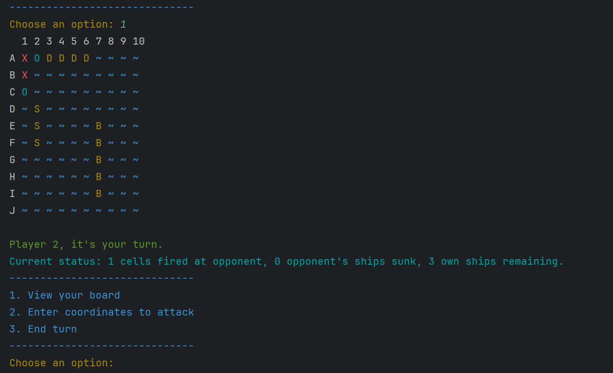

# SeaBattle

This is a console-based implementation of the classic Sea Battle game (also known as Battleship) built using Java. It allows two players to engage in a strategic naval showdown, taking turns to guess the location of their opponent's ships. 

The project was done by [Hán Hữu Đăng](https://github.com/iwillcthew), in the course of Object Oriented Programming at [ProPTIT](https://proptit.com/).

## Tech Stack

- **Programming Language:** [Java](https://www.java.com/en/)
- **IDE:** [IntelliJ IDEA](https://www.jetbrains.com/idea/)

## Software Design (UML)

- **Class Diagram:** [UML Diagram](Image/UML.png) 

## Demo Video

- [Demo Video](https://youtu.be/zHNdtnwiTPA) 

## Demo Image

- 
- 
- 
- 

## Features

- **Two-player gameplay:**  Engage in a head-to-head battle against a friend.
- **Interactive console interface:**  Easy-to-understand menus and prompts guide players through the game.
- **Color-coded board display:**  Visualize the game board with distinct colors for hits, misses, and ships.
- **Ship placement:**  Players strategically position their ships on the board during the setup phase.
- **Turn-based combat:** Players alternate turns firing shots at their opponent's board.
- **Win condition:** The first player to sink all of their opponent's ships wins the game.

## Installation

1. **Clone the repository:** `git clone https://github.com/your-username/sea-battle.git`
2. **Open the project:** Open the project in IntelliJ IDEA or your preferred Java IDE.
3. **Compile and run:** Build and run the `Main.java` file to start the game.

## Usage

### Project Structure
```bash

├── src
│   ├── main
│   │   ├── java
│   │   │   ├── main
│   │   │   │   ├── Main.java
│   │   │   ├── manager
│   │   │   │   ├── BoardManager.java
│   │   │   │   ├── GameManager.java
│   │   │   │   ├── PlayerManager.java
│   │   │   ├── model
│   │   │   │   ├── Coordinate.java
│   │   │   │   ├── Player.java
│   │   │   │   ├── Ship.java
│   │   │   │   ├── ShipType.java
│   │   │   ├── util
│   │   │   │   ├── ScreenUtil.java

```
## Contributing

Pull requests are welcome. For major changes, please open an issue first
to discuss what you would like to change.

Please make sure to update tests as appropriate.

## License

[MIT](https://choosealicense.com/licenses/mit/)
